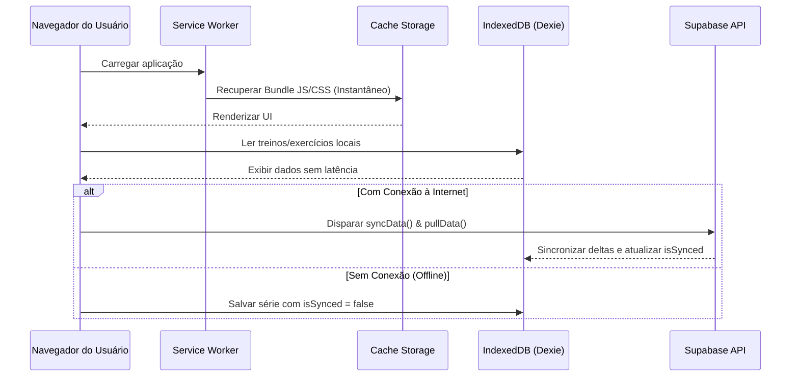

# Diretrizes e Arquitetura PWA (Progressive Web App)

## 1. Visão Geral do PWA

O **Registro de Treinos** é projetado como uma **PWA Standalone de Alta Disponibilidade**, permitindo que praticantes de musculação utilizem o aplicativo em academias sem conexão à internet (subsolos ou áreas com sinal fraco) com funcionamento idêntico ao modo online.

---

## 2. Configuração do Manifesto (`public/manifest.json`)

O arquivo de manifesto define o comportamento de instalação no sistema operacional:
```json
{
  "name": "Registro de Treinos",
  "short_name": "Treinos",
  "description": "PWA para rastreamento de hipertrofia, análise de performance e biofeedback.",
  "start_url": ".",
  "display": "standalone",
  "background_color": "#181A20",
  "theme_color": "#181A20",
  "icons": [
    {
      "src": "/icon-192.png",
      "sizes": "192x192",
      "type": "image/png"
    },
    {
      "src": "/icon-512.png",
      "sizes": "512x512",
      "type": "image/png"
    }
  ]
}
```

### Propriedades Críticas:
- `display: "standalone"`: Oculta barras de navegação do browser para oferecer experiência de aplicativo nativo.
- `theme_color`: Define a cor da barra de status no Android e iOS (#181A20).
- `start_url: "."`: Garante que a abertura do app respeite a rota de entrada preservando a sessão autenticada.

---

## 3. Service Worker e Estratégia de Cache

### 3.1. Estratégia de Cache para Assets Estáticos (Cache-First / Stale-While-Revalidate)
1. **Assets Estáticos**: O bundle de produção (JS, CSS, fontes e ícones) é armazenado em cache para inicialização instantânea.
2. **Requisições de API (Supabase)**: Utilizam a estratégia **Network-First** com fallback inteligente para a base IndexedDB local.

### 3.2. Ciclo de Vida do Service Worker


---

## 4. Guia de Instalação e Testes

### 4.1. Instalação no iOS (Safari)
1. Abra o aplicativo no navegador Safari.
2. Toque no botão **Compartilhar** (ícone do quadrado com a seta para cima).
3. Role para baixo e selecione **Adicionar à Tela de Início**.
4. Confirme o nome e toque em **Adicionar**.

### 4.2. Instalação no Android (Chrome)
1. Abra o app no Google Chrome.
2. Toque no banner automático "Instalar aplicativo" ou no menu de três pontos.
3. Selecione **Instalar Aplicativo** ou **Adicionar à tela inicial**.

---

## 5. Próximos Aprimoramentos PWA (Roadmap)
- [ ] Implementação de **Web Push Notifications** para lembretes de consistência e horário de treino programado.
- [ ] Registro de **Background Sync API** para envio automático de dados assim que a conexão de rede for restabelecida.
