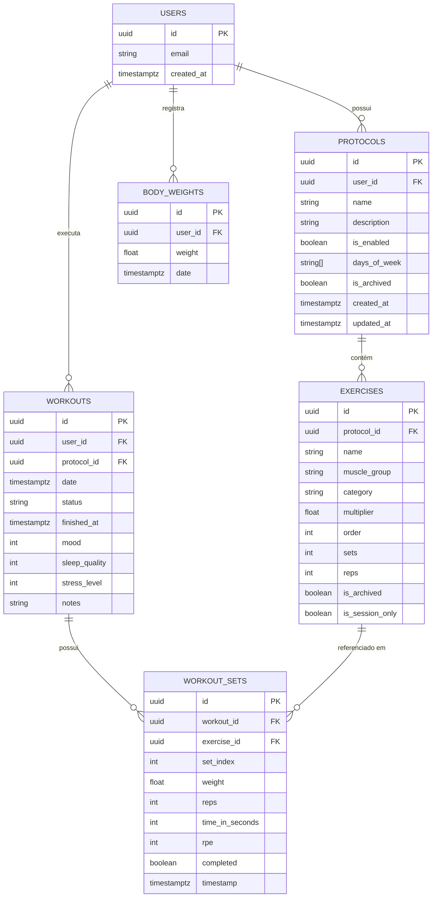

# Guia de Reconstrução e Especificação Funcional

Este documento consolida todas as regras de negócio, especificações e requisitos essenciais para a reconstrução, manutenção ou evolução do sistema **Registro de Treinos**.

> [!NOTE]
> Para o detalhamento completo dos cálculos, fórmulas e fluxos, consulte também [SPECIFICATION.md](file:///home/gabrielsales/meus_apps/registrotreinos/docs/SPECIFICATION.md) e [ARCHITECTURE.md](file:///home/gabrielsales/meus_apps/registrotreinos/docs/ARCHITECTURE.md).

---

## 1. Escopo Funcional do Sistema

1. **Gestão de Sessões de Treino**:
   - Criação de protocolos personalizados com dias específicos da semana atribuídos.
   - Adição e reordenação interativa de exercícios por protocolo (com suporte a drag-and-drop).
   - Suporte a 3 categorias de exercícios: Carga Tradicional (`weight`), Peso Corporal/Calistenia (`bodyweight`) e Isometria/Tempo (`time`).
2. **Execução de Treino em Tempo Real**:
   - Carregamento instantâneo do treino ativo sem dependência de internet.
   - Exibição de histórico anterior imediato para cada exercício ("Ant: Carga x Reps").
   - Registro série a série com salvamento reativo em IndexedDB.
   - Adição dinâmica de exercícios apenas para a sessão atual (`isSessionOnly`).
3. **Métricas de Performance & Análise Fisiológica**:
   - Volume total de carga ponderado por categoria.
   - Cálculo de 1RM estimado (fórmula de Epley) e Força Relativa ($\text{1RM} / \text{Peso Corporal}$).
   - Radar de distribuição de volume por grupo muscular e análise de assimetrias.
   - Acompanhamento da curva de peso corporal.
4. **Sincronização em Nuvem (Cloud Sync)**:
   - Sincronização delta bidirecional com Supabase (PostgreSQL + RLS).
   - Conversão transparente entre formatos de chave (camelCase no frontend e snake_case no PostgreSQL).
   - Resolução de conflitos baseada em carimbo de data/hora e flags `isSynced`.

---

## 2. Modelagem Entidade-Relacionamento

